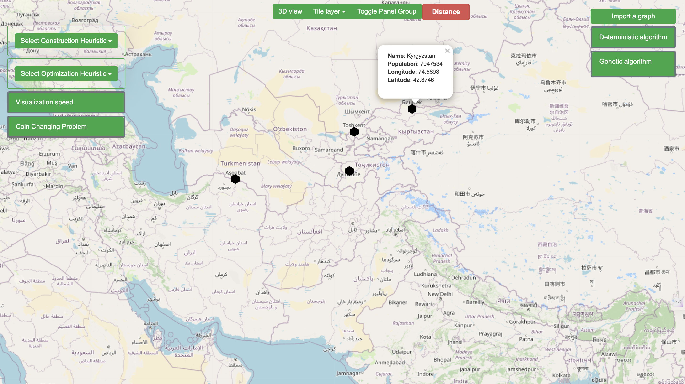

# Shortest Path Finder for Cities


This project is a web application built with Flask that helps users find the shortest path between different cities using various algorithms. It is designed to be intuitive and easy to use, making it accessible for users with varying levels of technical expertise.


## Features

- **Multiple Algorithms:** Choose from a variety of algorithms, including Dijkstra's algorithm, A* algorithm, and more, to find the shortest path between cities.
- **Interactive Map:** Visualize the path on an interactive map for a better understanding of the route.
- **User-Friendly Interface:** The web interface is designed to be intuitive and easy to use, making it accessible for users with varying levels of technical expertise.

## Screenshots




## Video Demo


## Getting Started

These instructions will get you a copy of the project up and running on your local machine for development and testing purposes.

### Prerequisites

- Python 3.x
- Flask

### Installation

1. Clone the repository:

    ```bash
    git clone https://github.com/Alibakhshov/Shortest-Path-Finder-for-Cities.git
    ```

2. Navigate to the project directory:

    ```bash
    cd Shortest-Path-Finder-for-Cities
    ```

3. Install dependencies:

    ```bash
    pip install -r requirements.txt
    ```

### Usage

1. Navigate to the project directory:

    ```bash
    cd Shortest-Path-Finder-for-Cities/source
    ```

2. Run the Flask application:

    ```bash
    flask run
    ```

2. Open your web browser and go to [http://localhost:5000](http://localhost:5000).


## Built With

- [Flask](https://flask.palletsprojects.com/en/1.1.x/) - The web framework used
- [Leaflet](https://leafletjs.com/) - The JavaScript library used for the interactive map
- [Bootstrap](https://getbootstrap.com/) - The CSS framework used for styling
